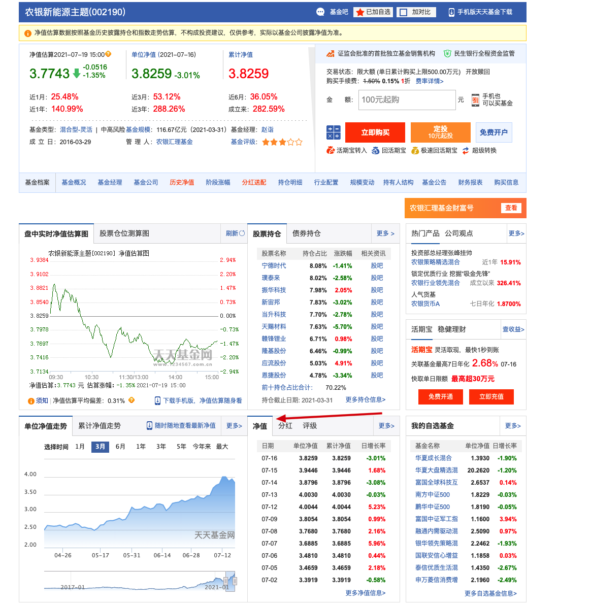
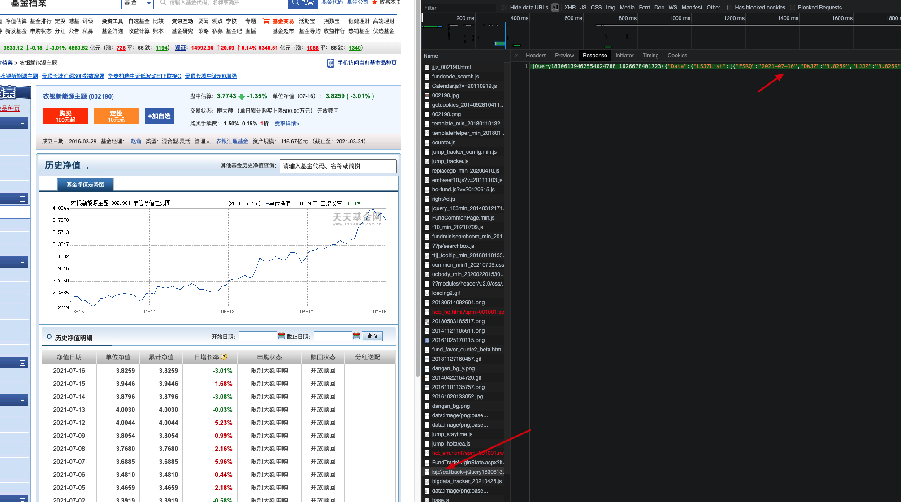
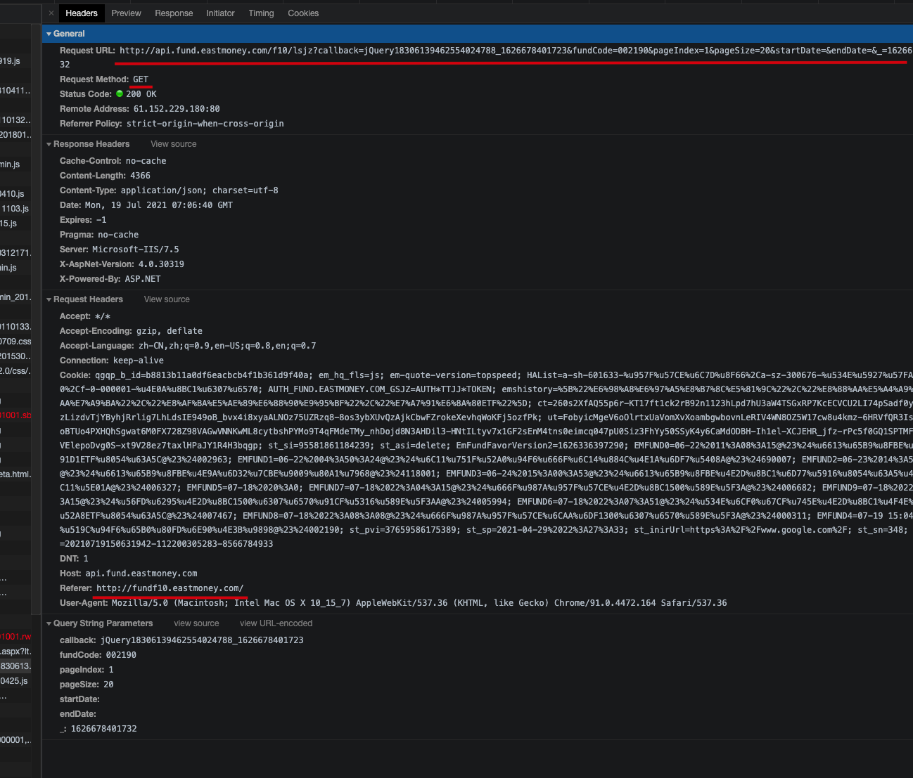
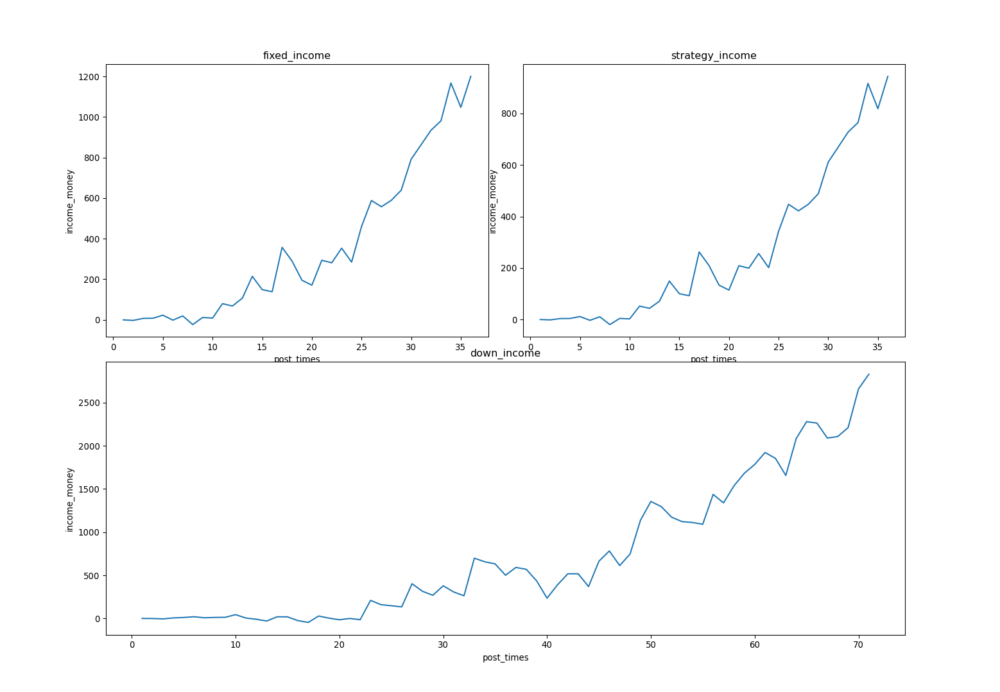
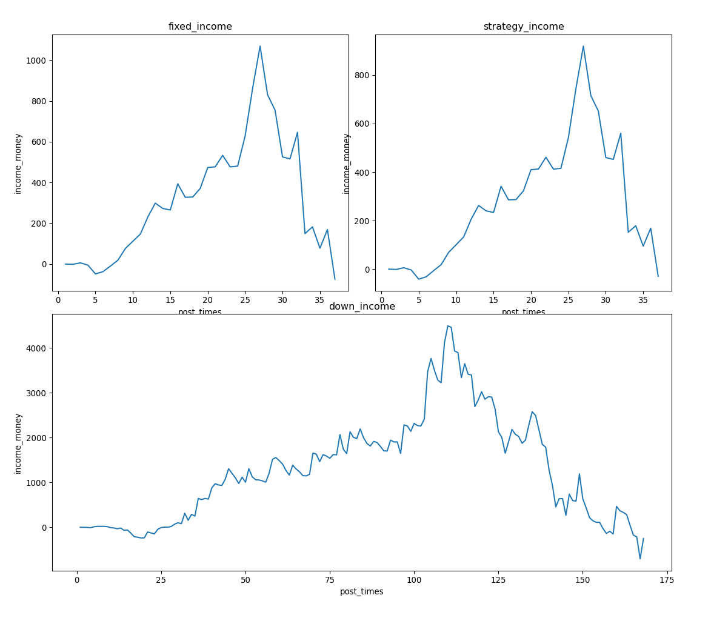
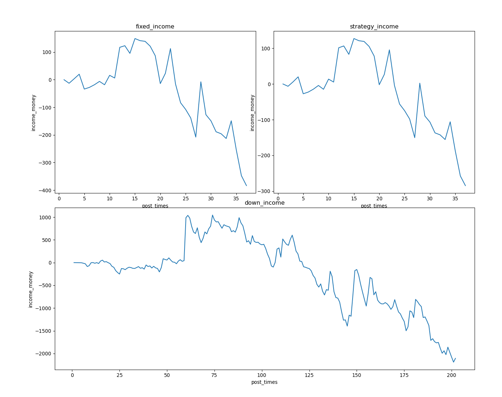
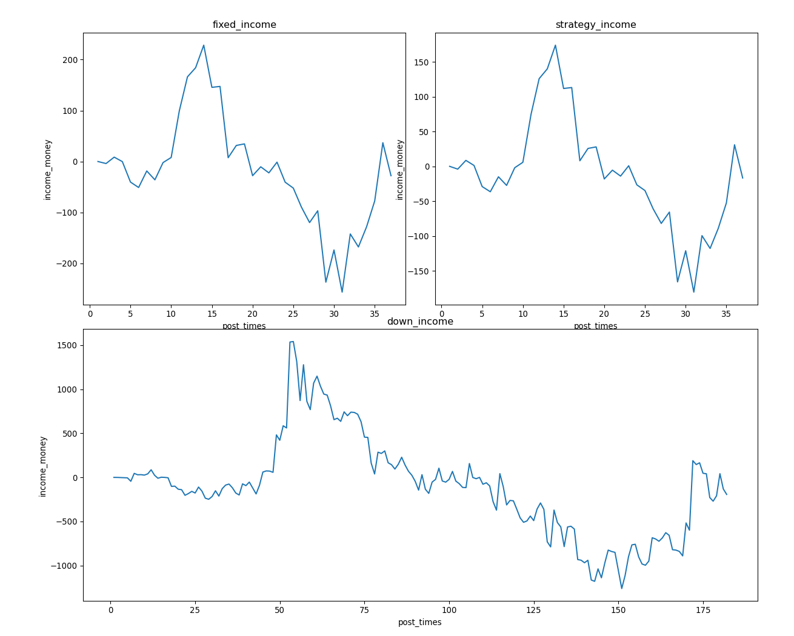
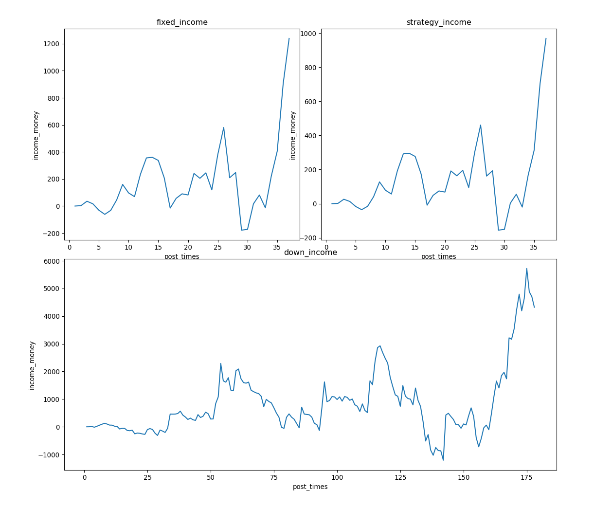

# 基金定投真的能赚钱吗？

> 通过历史的基金数据来模拟各种类型的定投操作来看看基金定投是否真的能够赚钱呢？我们会选择不同类型的赛 道来进行模拟定投，比如主动型权益基金、混合基金、债基亦或者使用宽基和窄基来看数据说话（投资有风险，入市需谨慎）

## 1. 引言

当我们打开某某宝和某某基金平台时，看到的都是年化 40% 、50%甚至 120% 的收益时，你心动了吗？2020年平均基民收入 10w，可是为什么有那么多人却都亏钱了呢？财经博主会告诉你基金定投能够帮你平滑基金收益的风险，那这次我们就用过去的历史数据模拟各种模式的基金定投来看看是是否真的能够赚钱？

## 2. 方法

在开始 coding 之前需要分析清楚几个前置问题，包括：

1. 一支基金收益如何计算？
2. 如何模拟定投的操作？

### 2.1. 基金收益如何算

注：基于此次模拟操作重点关注在基金定投是否能够挣钱以及如何模拟定投操作，这里忽略手续费、管理费和赎回费等各种费用

```
# 1.收益率
基金收益率 = 当前累计基金净值(当天) - 期初净值(定投开始) / 期初净值
# 2.基金收益
基金收益 = （当前累计基金净值(当天) - 期初净值(定投开始) ）* 持有份额
```

举个:chestnut:

以农银新能源主题（002190）为例

| 日期       | 单位净值 | 累计净值 | 日增长率 |
| ---------- | -------- | -------- | -------- |
| 2021-07-16 | 3.8259   | 3.8259   | -3.01%   |
| 2021-07-15 | 3.9446   | 3.9446   | 1.68%    |

如果在 7.15 买入 1000块此基金那么在 7.16 的收益就是（忽略手续费）

```
收益=份额（投入的钱数/单位净值） * (当前累计净值-期初净值)
-30.09=1000/3.9446 * (3.8259-3.9446)
```

### 2.2. 模拟定投的策略

将基金定投的行为抽象为结果就是：

1. 固定时间间隔定额投入。如：每隔 5个交易日投200
2. 根据净值涨跌不同额度定投：净值跌 投 && 净值涨少投跌多投。如：每隔5个交易日，如果跌我投 100，涨我投 200

### 2.3. 实践模拟操作

#### 2.3.1. 获取基金的历史数据

找到天天基金网看到有净值的部分，打开浏览器检查，查其获取数据的方式



找到其中具有历史净值的返回 HTTP 请求



详细查看其中请求的 URL 和请求参数以及 Referer ，方便后续模拟请求



分析 api 返回的数据结构方便后续取需要的字段

```json
{
    "Data": {
        "LSJZList": [
            {
                "FSRQ": "2021-07-16",
                "DWJZ": "3.8259",
                "LJJZ": "3.8259",
                "SDATE": null,
                "ACTUALSYI": "",
                "NAVTYPE": "1",
                "JZZZL": "-3.01",
                "SGZT": "限制大额申购",
                "SHZT": "开放赎回",
                "FHFCZ": "",
                "FHFCBZ": "",
                "DTYPE": null,
                "FHSP": ""
            },
            {
                "FSRQ": "2021-07-15",
                "DWJZ": "3.9446",
                "LJJZ": "3.9446",
                "SDATE": null,
                "ACTUALSYI": "",
                "NAVTYPE": "1",
                "JZZZL": "1.68",
                "SGZT": "限制大额申购",
                "SHZT": "开放赎回",
                "FHFCZ": "",
                "FHFCBZ": "",
                "DTYPE": null,
                "FHSP": ""
            }
        ],
        "FundType": "002",
        "SYType": null,
        "isNewType": false,
        "Feature": "215"
    },
    "ErrCode": 0,
    "ErrMsg": null,
    "TotalCount": 1249,
    "Expansion": null,
    "PageSize": 20,
    "PageIndex": 1
}
```

开始尝试用上述的分析获取具体的数据：

```python
# encoding: utf-8
# 使用 requests 库进行 api 模拟请求
import requests
# 1.获取历史数据
def get_funds_data(fundCode, pageIndex, post_days):
    url = 'http://api.fund.eastmoney.com/f10/lsjz'
    params = {
        'fundCode': fundCode,
        'pageIndex': pageIndex,
        'pageSize': post_days
    }
    headers = {
        'Referer': 'http://fundf10.eastmoney.com/'
    }
    res = requests.get(url=url, headers=headers, params=params).json()
    funds_daylists = res['Data']['LSJZList']
    return funds_daylists
```

#### 2.3.2. 模拟定投策略

```python
# 模拟定投方法
# 1.固定时间固定投入
# 2.跌投涨投
def funds_fixed_investment(post_money, post_down_money, step, funds_daylists, set_invest_strategy=False):
    # 初始化份额和本金
    sum_share = sum_money = 0
    income_daily = {}
    for day_num in range(0, len(funds_daylists), step):
        try:
            sum_share, sum_money = post_money_to_funds(post_money, post_down_money, sum_share, sum_money, day_num, funds_daylists, set_invest_strategy)
            income_daily[funds_daylists[day_num]["FSRQ"]] = sum_share * float(funds_daylists[day_num]["DWJZ"]) - sum_money
        except Exception as e:
            print(e)
            pass
    total_money = sum_share * float(funds_daylists[len(funds_daylists)-1]['DWJZ'])
    holding_yield = (total_money-sum_money)/sum_money
    print("本金：", sum_money,"总金：", total_money,"持有收益：", total_money-sum_money,"持有收益率：", holding_yield)
    return income_daily

# 每次定投的方法
def post_money_to_funds(post_money, post_down_money, sum_share, sum_money, day_num, funds_daylists, set_invest_strategy):
    # 根据参数判断是否需要使用不同策略进行投入
    if not funds_daylists[day_num]['JZZZL']:
        daily_income = 0
    else:
        daily_income = funds_daylists[day_num]['JZZZL']
    if set_invest_strategy and float(daily_income) < 0:
        sum_share, sum_money = post_money_single(post_down_money, sum_share, sum_money, day_num, funds_daylists)
    else:
        sum_share, sum_money = post_money_single(post_money, sum_share, sum_money, day_num, funds_daylists)
    return sum_share, sum_money

# 3.逢跌买入策略方法
def funds_down_investment(post_money, funds_daylists):
    sum_share = sum_money = 0
    income_daily = {}
    for daylist in funds_daylists:
        try:
            if float(daylist['JZZZL'])< 0:
                share = post_money / float(daylist['DWJZ'])
                sum_share += share
                sum_money += post_money
                income_daily[daylist['FSRQ']] = sum_share * float(daylist['DWJZ']) - sum_money
        except Exception:
          pass
    total_money = sum_share * float(funds_daylists[len(funds_daylists)-1]['DWJZ'])
    holding_yield = (total_money-sum_money)/sum_money
    print("本金：", sum_money,"总金：", total_money,"持有收益：", total_money-sum_money,"持有收益率：", holding_yield)
    return income_daily 

def post_money_single(post_money, sum_share, sum_money, day_num, funds_daylists):
    share = post_money / float(funds_daylists[day_num]['DWJZ'])
    sum_share += share
    sum_money += post_money
    return sum_share, sum_money
```

#### 2.3.3 将开始每次定投的收益绘制成收益曲线更直观

```python
# 开始计算收益
def funds_investment_compute(funds_name, funds_code, step, days, post_money, post_down_money):
    print("%s 基金收益表现如下：" % funds_name)
    funds_daylists = get_funds_data(funds_code, 1, days)
    funds_daylists.reverse()
    # 固定投
    fixed_income = funds_fixed_investment(post_money, post_down_money, step, funds_daylists)
    # 策略投
    strategy_income = funds_fixed_investment(post_money, post_down_money, step, funds_daylists, True)
    # 逢跌投
    down_income = funds_down_investment(post_money, funds_daylists)
    paiter_income(fixed_income, strategy_income, down_income)
# 绘制含有三个子图的收益图
def paiter_income(fixed_income, strategy_income, down_income):
    x1arr, y1arr = handle_pait_data(fixed_income)
    x2arr, y2arr = handle_pait_data(strategy_income)
    x3arr, y3arr = handle_pait_data(down_income) 
    plt.figure(figsize=(12, 12), dpi=96)

    ax1=plt.subplot2grid((4,4),(0,0),colspan=2,rowspan=2)
    ax1.plot(x1arr,y1arr)
    ax1.set_title('fixed_income')
    ax1.set_xlabel('post_times')
    ax1.set_ylabel('income_money')

    ax2=plt.subplot2grid((4,4),(0,2),colspan=2,rowspan=2)
    ax2.plot(x2arr,y2arr)
    ax2.set_title('strategy_income')
    ax2.set_xlabel('post_times')
    ax2.set_ylabel('income_money')    

    ax3=plt.subplot2grid((4,4),(2,0),colspan=4,rowspan=2)
    ax3.plot(x3arr,y3arr) #轴的范围，x轴，y轴。 
    ax3.set_title('down_income')
    ax3.set_xlabel('post_times')
    ax3.set_ylabel('income_money')    
    plt.show()    
# 处理日期为收益方法
def handle_pait_data(income_data):
    funds_dates = []
    funds_income = []
    day_num = 1
    for _, value in income_data.items():
        funds_dates.append(day_num)
        funds_income.append(value)
        day_num += 1
    return funds_dates, funds_income
```

#### 2.3.4 呈现

```python
# 以中证50指数基金为例，180天前开始定投，每隔 5天定投，
# 定额定投：每次200
# 策略定投：每次跌200，每次涨投100
# 逢跌定投：每次200
funds_investment_compute('中证50', '007994', 5, 180, 200, 100)
```

## 3. 结果

```
中证50 基金收益表现如下：
本金： 7200 总金： 8593.410131491137 持有收益： 1393.4101314911368 持有收益率： 0.19352918492932455
本金： 6000 总金： 7103.94694419058 持有收益： 1103.9469441905803 持有收益率： 0.18399115736509672
本金： 14200 总金： 17030.25213354043 持有收益： 2830.252133540431 持有收益率： 0.19931353053101625
```



## 4. 讨论

这里我们选取各个赛道的基金来模拟，看看是否定投都能有收益，哪种会更好些

>     # 固定定投策略：每隔10天投100
>     # 智能定投策略：每隔10天涨投50, 跌投100
>     # 逢跌定投策略：每次投 100
>     # 天数： 365

| 基金名称                         | 基金代码 | 固定定投（本金/收益/收益率） | 智能定投（本金/收益/收益率） | 逢跌定投（本金/收益/收益率） |
| -------------------------------- | -------- | ---------------------------- | ---------------------------- | ---------------------------- |
| 新能源：东方新能源汽车主题混合   | 400015   | 3700/4518/122%               | 2700/3342/123%               | 16600/21043/126%             |
| 芯片：诺安成长                   | 320007   | 3700/846/22%                 | 2550/554/22%                 | 17800/4320/24%               |
| 医药：中欧医疗健康A              | 003095   | 3700/1458/39%                | 2300/895/38%                 | 15100/5962/39%               |
| 光伏：易方达环保主题灵活配置混合 | 001856   | 3700/2047/55%                | 2350/1316/56%                | 14300/8214/57%               |
| 白酒：招商中证白酒指数A          | 161725   | 3700/1027/27%                | 3000/779/25%                 | 14800/4378/29%               |
| 宽基指数：中证50                 | 007994   | 3100/967/31%                 | 1950/575/29%                 | 12200/3697/30%               |
| 宽基指数：创业板指数景顺长城创业 | 008072   | 2700/616/22%                 | 1750/361/20%                 | 10900/2480/22%               |

都涨了？真的闭着眼瞎买吗？我们去看看业绩不好的基金情况

| 基金名称                     | 基金代码 | 固定定投（本金/收益/收益率） | 智能定投（本金/收益/收益率） | 逢跌定投（本金/收益/收益率） |
| ---------------------------- | -------- | ---------------------------- | ---------------------------- | ---------------------------- |
| QDII：易方达亚洲精选股票     | 118001   | 3700/39/1%                   | 3000/63/2%                   | 16800/-31/-0.01%             |
| 地产：国泰国证房地产行业指数 | 160218   | 3700/-387/-10%               | 2750/-287/10%                | 20200/-2106/-10%             |
| 银河文体娱乐混合             | 005585   | 3700/-42/-1%                 | 2750/-27/-1%                 | 18200/-193/-1%               |

亚洲精选收益趋势



国泰国证房地产行业收益趋势



银河文体娱乐混合收益趋势



## 5. 结论

1. 不同模式的定投其实收益差别不会太大，但是因为投入的本金不同所以但凡选择成长性较好的赛道那么无论执行那种定投策略都有不错的收益；

2. 赛道选取很重要，不同板块的基金收益相差千差万别，如果是小白直接定投大盘指数风险小些，比如 中证50 和 创业板指数

3. 懂得止盈也很重要，尤其是对于波动较大的板块，比如芯片，来看一下其收益趋势，堪比过山车，最近才回暖

   


